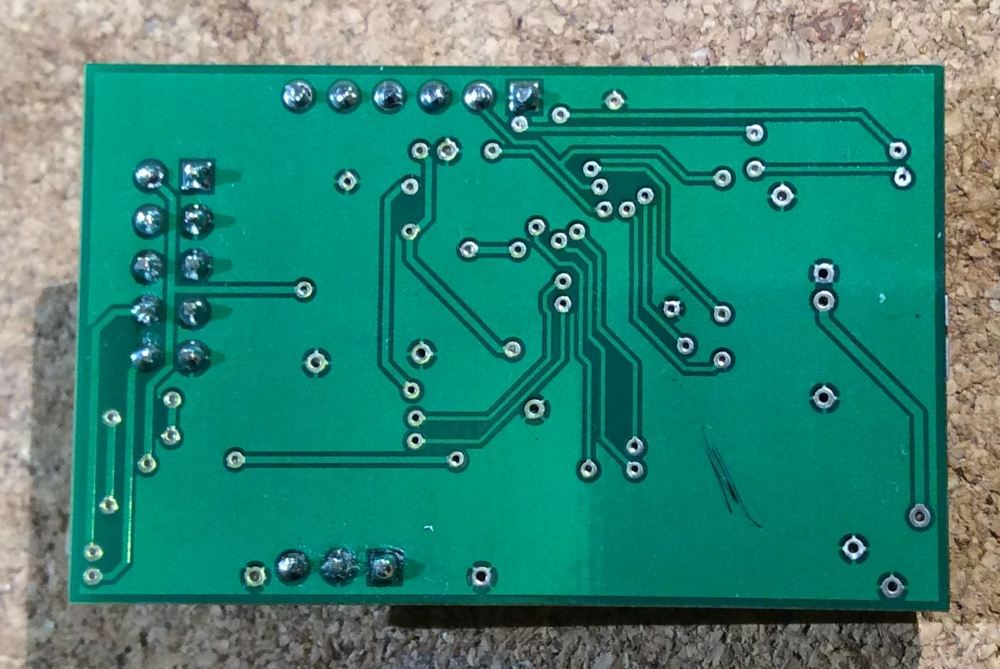

This board is an evolution of the Blackmagic Riachardeoin board. This board has been built
and functions.

## The major differences

Compared to the Ricahrdeoin variant:
* PCB has been re-designed to allow assembly at home. It is a single sided PCB with 1206 passive components.
* Added CAN interface
* Added 2.54mm IDC connector
* MicroUSB intead of miniUSB
* Uses STM32F105RCT6 instead of STM32F103

Due to the bigger components the size of the board is larger: 48mm x 30mm.

The board has been designed with the free DesignSpark PCB tool.

## Parts

See the [Parts List](Parts.md)

There were a number of adjustments on the BOM after the board has been manufactured. The included part list is valid and more up to date than the schematic.

## Known bugs

There is one known problem with this versionn of the board. The 1k5 USB pull-up resistor is connected to the "D-" USB pin 
instead of the "D+". Theresult is that the host is enumerating the board as Low-speed. To workaround this the R23 
shall be re-wired to connect to R20 instead of R18. See the picture above for the details on how it is solved.

## Software differences

Due to different CPU variant the following changes were needed:

* stm32_mem.py has been changed to upload 2K blocks instead of 1K because the Flash block size is 2K on STM32105.
* USB driver of STM32105 differs from the STM32F103 variant. SRC/PLATFORMS contains a lyorak subfolder with the necessary changes.

use "make PROBE_HOST=lyorak" to build the boot loader and the gdb application for the lyorak variant.

